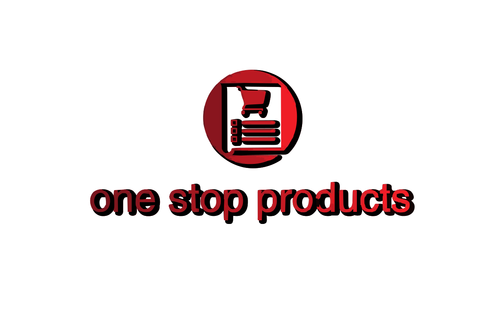

# OneStopShop

## Table of Contents
 - Introduction
 - Features
 - Technologies Used
 - Project Structure
 - Installation
 - Environment Variables
 - Running the Application
 - API Documentation
 - Database Schema
 - Testing
 - Deployment
 - Contributing
 - License

## Introduction

The One Stop Products Platform (Shop) is an e-commerce site designed to efficiently handle a wide range of products from various categories.
The platform aims to enhance search relevance by accurately identifying customer inputs and providing precise search results. 
It includes robust admin features for managing products and users and generates valuable analytics.

## Features
- User Management: Authentication, authorization, and user profile management.
- Product Management: CRUD operations for products, categories, and inventory.
- Order Management: Handling user orders, cart items, and order status.
- Wishlist Management: Adding and removing items from user wishlists.
- Review System: Allowing users to review and rate products.
- Admin Panel: Admin-only routes for managing users and products.

## Technologies Used
 - Backend Framework: Flask
 - Database: SQLAlchemy (with PostgreSQL/MySQL)
 - Authentication: Flask-JWT-Extended for  JWT-based authentication
 - Environment Management: Python Dotenv for managing environment variables
 - Data Serialization: Marshmallow for input validation and serialization
 - Testing: Pytest for unit and integration tests
 - Deployment: Docker, Gunicorn, Nginx


Project Sructure

```
one_stop_shop/
│
├── server/
│   ├── __pycache__
│   ├── assets
│   ├── instance
│   ├── migrations
│   ├── app.py
|   ├── authenticate.py
│   ├── config.py
│   ├── models.py
│   ├── orders.py
│   ├── products.py
│   ├── Search.py
│   ├── seed.py
│   ├── test_app.py
│   ├── test_authenticate.py
│   ├── test_file.py
│   ├── test_orders.py
│   ├── test_products.py
│   ├── test_search.py
│   └── wishlist.py
│
├── Pipfile
├── Pipfile.lock
└── README.md

```

## Installation
### Prerequisites
Before you begin, ensure you have the following installed on your system:

  - Python 3.8 or higher
  - pip (Python package manager)
  - PostgreSQL/MySQL (for the database)
  - Docker (for containerization, optional)


## Clone the Repository
```
git clone git@github.com:Rhoda-NM/OneStopShop-Project.git
```

## Install Dependencies
It's recommended to use a virtual environment to manage dependencies:

```
pipenv install
pipenv shell
```

## Running the Application
### Database Setup
 1. Initialize the Database:

 ```
flask db init
flask db migrate -m "Initial migration"
flask db upgrade
```

 2. Seed the Database:

You can create a script to seed your database with initial data or do it manually through the Flask shell.

### Start the Server
```
 flask run
 ```

 The application will be available at 'http://127.0.0.1:5000'.


## API Documentation
The API provides the following endpoints:

### Authentication
 - POST /auth/login: Log in a user and return a JWT token.
 - POST /auth/register: Register a new user.

### Products
 - GET /products: Retrieve a list of products.
 -  GET /products/:id: Retrieve details of a specific product.
 - POST /products: Add a new product (Admin only).
 - PUT /products/:id: Update an existing product (Admin only).
 - DELETE /products/:id: Delete a product (Admin only).

### Orders
 - POST /orders: Create a new order.
 - GET /orders/:id: Retrieve an order by its ID.
 - GET /orders: List all orders for the authenticated user.

### Users
 - GET /users/profile: Retrieve the authenticated user's profile.
 - PUT /users/profile: Update the authenticated user's profile.

## Full API Documentation
For a more detailed API documentation, you can use tools like Postman or Swagger to interact with and explore the API.

## Database Schema
## Example Models:
 - User: Represents a user with fields like id, username, email, password_hash, etc.
 - Product: Represents a product with fields like id, name, description, price, stock, etc.
 - Order: Represents an order with fields like id, user_id, status, total_amount, etc.
 - Wishlist: Represents a user's wishlist with fields like user_id, product_id.
 - Review: Represents a product review with fields like id, user_id, product_id, rating, comment.

## Relationships:

 1. A User can have many Orders.
 2. A Product can be associated with many Orders.
 3. A User can add many Products to their Wishlist.

 ## Testing
### Running Tests

Tests are located in the tests/ directory. To run all tests:
```
pytest
```
This command will automatically discover and run tests.

### Test Coverage
To check the test coverage, you can use:
```
pytest --cov=app tests/
```
This will show you the coverage percentage of your codebase.

## Deployment
### Docker Deployment
To deploy the application using Docker:

 1. Build the Docker Image:
 ```
 docker build -t onestopshop-Project .
 ```

 2. Run the Application using Docker Compose:
 ```
 docker-compose up
```

This will set up the application in a containerized environment along with a database service.

### Manual Deployment
For manual deployment, ensure that your server environment is set up with:

  - Python 3.8+
  - A PostgreSQL/MySQL database
  - Gunicorn (for running the Flask app)
  - Nginx (as a reverse proxy)
Steps:

 1. Install dependencies on the server:
 ```
 pip install -r requirements.txt
```

 2. Set up environment variables and database.

 3. Run database migrations:
 ```
 flask db upgrade
```

 4. Start the Gunicorn server:
 ```
 gunicorn --workers 4 --bind 0.0.0.0:8000 wsgi:app
```

 5. Configure Nginx to reverse proxy requests to the Gunicorn server.


 ## Contributing
We welcome contributions from the community! If you'd like to contribute, please follow these steps:

 1. Fork the repository.
 2. Create a new branch for your feature or bug fix.
 3. Make your changes 
 4. Commit them changes with  clear and descriptive messages.
 5. Push your changes to your fork.
 6. Submit a pull request to the main repository.

Please ensure that your code follows the project's coding standards and includes relevant tests.

## Contributors

- **Scrum Master**: [Rhoda Muya](https://github.com/Rhoda-NM)
- **Group Members**:
  - [Maria Wanjiru](https://github.com/mwanjiru12)
  - [Bravin Kibet](https://github.com/Bravinkibet)
  - [Ephy Muiruri](https://github.com/Ephymuiruri)
  - [Brian Onduso](https://github.com/BrianOnduso0)
  - [Lennis Maina](https://github.com/Maichmaina)

## License
This project is licensed under the MIT License. See the LICENSE file for more details.